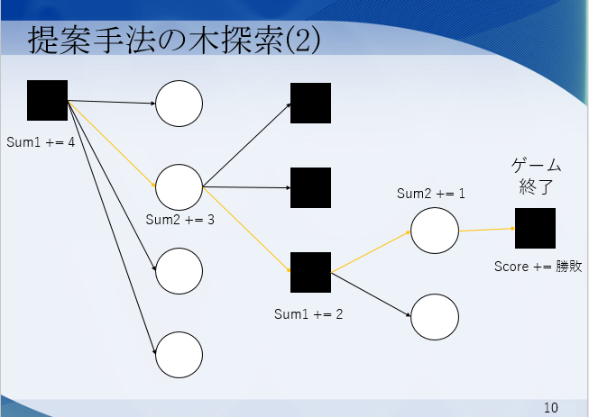
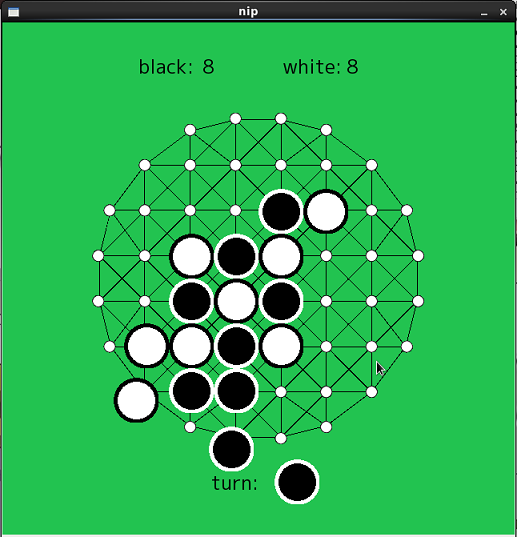

---
revealjs-url: https://cdnjs.cloudflare.com/ajax/libs/reveal.js/3.3.0
theme: beige
history: true
# minScale: 1.4
css: style.css

title: 進捗報告
author: Sodeyama
date: 2016.7.15
...

# 概要

----------------

 - 現状
 - 論文紹介
 - 研究テーマについて
 - 今後の予定

# 現状

## モンテカルロ木探索実装中

## 論文を読んでみた

--------------

title

:    局所評価関数を使う新たなUCT探索法の提案とオセロによる評価

author

:    前原彰太 橋本剛 小林康幸

date
:    2010年6月

in
:    情報処理学会研究報告

# 論文紹介

## 「局所評価関数を使う新たなUCT探索法の提案とオセロによる評価」

## 内容一覧

- 研究背景
- UCB値とモンテカルロ木探索
- 提案手法
- 実験結果

## 研究背景

- モンテカルロ木探索 = モンテカルロ法 + UCT
- 局面の評価関数の研究はほとんど行われていない

→UCBの値に局面評価関数を加えてみる

## UCB値とモンテカルロ木探索

 - 計算式 : $$UCB値 = \overline{ x_j }+c\sqrt{ \frac{ 2\log n }{ n_j } }$$
 - $\overline{ x_j }$ : 期待値
 - $c\sqrt{ \frac{ 2\log n }{ n_j } }$ : バイアス

## 大浦の手法

 - 合法手の数をカウント
 - オセロ : 合法手が多い = 有利
 - 終局の情報　＋　合法手の数

## 提案手法の木探索

 - Sum1 : 先手の子ノード数
 - Sum2 : 後手の子ノード数
 - Score : 終局での状況
 - ■ : 先手番ノード
 - 〇 : 後手番ノード

----------

## 提案手法 : UCT+

 - $$UCB値 = (\overline{ x_j }+E_j)+c\sqrt{ \frac{ 2\log n }{ n_j } }$$
 - $E_j$ : Sum1,Sum2
 - $x_j$ : Score

## 実験結果

以下に実験結果[^longnote1]を記載する.

[^longnote1]:引用:

	「局所評価関数を使う新たなUCT探索法の提案とオセロによる評価」  
	前原彰太　橋本剛　小林康幸　  
	2010年6月  
	情報処理学会研究報告  

----------

------------------------------------------------------
                                S=30        S=40
---------------------------- ------------ ------------
    Playout=10000                47.83       56.33

    Playout=30000                50.17       63.50
------------------------------------------------------

Table: 表1 UCTによる正解率(単位:%)

----------

------------------------------------------------------
                                S=30        S=40
---------------------------- ------------ ------------
    Playout=10000                82.17       82.50

    Playout=30000                87.50       88.33
------------------------------------------------------

Table: 表2 UCT+による正解率(単位:%)

----------

------------------------------------------------------
                                S=30        S=40
---------------------------- ------------ ------------
    ランダムプレイ                45.30       46.70

 モンテカルロ法(Playout=2000)      45.00       57.33
------------------------------------------------------

Table: 表3 単純な手法の正解率(単位:%)

-----------

 - 最善手がわかっている棋譜ファイル300件と比較
 - S=40は初手から40手目が終了した局面から探索を開始するということ

## 考察

 - 表1,表2ともに探索数が多いと正解率も高い
 - 表1,表3から,木が成長しないモンテカルロ法より,木が成長するUCT探索が優れていることがわかる
 - UCTよりUCT+のほうが勝率が高い

# 研究テーマについて

----------

 - nipでモンテカルロ法を実装中
 - ランダムに位置を選んでtipを置くことはできた

\
\
※[使用素材][FOO]

[Foo]:http://www.nakajim.net/index.php?plugin=attach&refer=%E3%83%80%E3%82%A6%E3%83%B3%E3%83%AD%E3%83%BC%E3%83%89%E3%81%A7%E3%81%8D%E3%82%8B%E3%83%AA%E3%82%BD%E3%83%BC%E3%82%B9&openfile=Nipp.pdf
 
----------

# 今後の予定

----------

 - 研究テーマの詳細を決める
 - CUDAの学習
